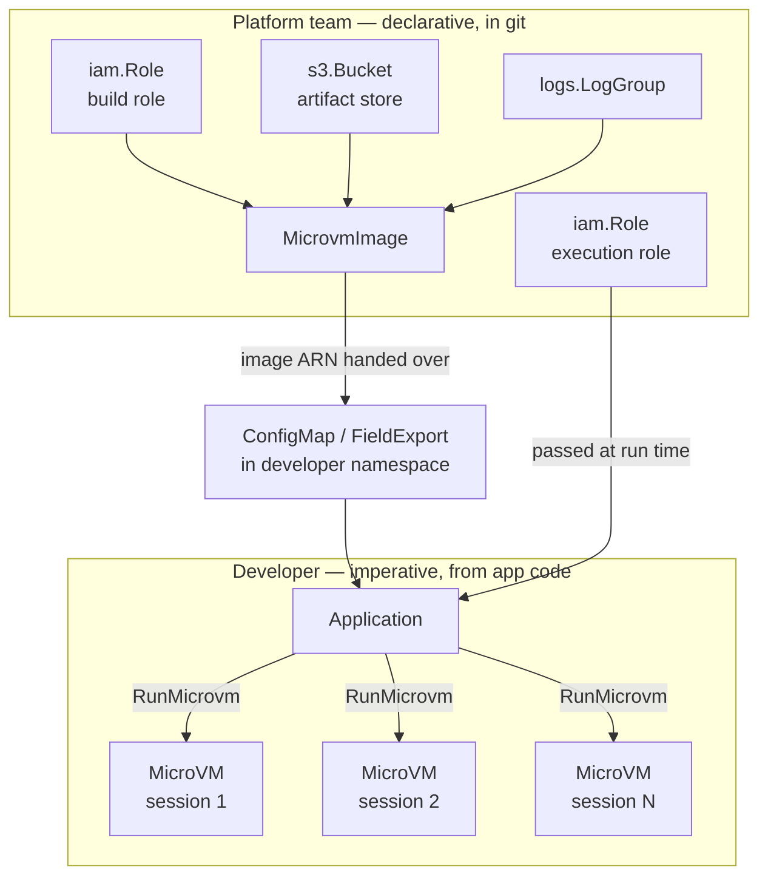

# ACK service controller for Lambda MicroVMs

This repository contains source code for the AWS Controllers for Kubernetes
(ACK) service controller for Lambda MicroVMs.

Please [log issues][ack-issues] and feedback on the main AWS Controllers for
Kubernetes Github project.

[ack-issues]: https://github.com/aws/aws-controllers-k8s/issues

## Contents

- [About Lambda MicroVMs](#about-lambda-microvms)
- [What this controller manages](#what-this-controller-manages)
- [Division of responsibility](#division-of-responsibility)
  - [The three IAM roles](#the-three-iam-roles)
  - [What is deliberately not a custom resource](#what-is-deliberately-not-a-custom-resource)
  - [When not to reach for a custom resource](#when-not-to-reach-for-a-custom-resource)
- [Installation](#installation)
  - [Controller IAM permissions](#controller-iam-permissions)
  - [Install the Helm chart](#install-the-helm-chart)
  - [Verify the installation](#verify-the-installation)
- [Resource reference](#resource-reference)
  - [MicrovmImage](#microvmimage)
  - [Microvm](#microvm)
  - [Reaching a running MicroVM](#reaching-a-running-microvm)
- [Examples](#examples)
- [Troubleshooting](#troubleshooting)
  - [Reading resource conditions](#reading-resource-conditions)
  - [Finding build logs](#finding-build-logs)
  - [Common failures](#common-failures)
  - [Forcing a reconcile](#forcing-a-reconcile)
- [Contributing](#contributing)
- [License](#license)

## About Lambda MicroVMs

[AWS Lambda MicroVMs][microvms-guide] are serverless compute environments that
provide VM-level isolation with full operating system capabilities, built on the
same Firecracker virtualization that powers Lambda functions. They are designed
for workloads where multiple users or AI agents connect to a compute environment
and run code: interactive development environments, AI code execution sandboxes,
data analytics workloads, security scanning, reinforcement learning
environments, multi-tenant CI/CD, and game servers.

The service model has two distinct halves:

1. **Build a MicroVM image.** You package application code and a `Dockerfile`
   into a zip archive and upload it to Amazon S3. Lambda executes the
   `Dockerfile`, starts your application, and captures a snapshot of the fully
   initialized environment.
2. **Run MicroVMs from that image.** Each image can launch many MicroVMs — one
   per tenant, user session, or job. MicroVMs start from the snapshot, so they
   skip application initialization. Clients reach them over a dedicated HTTPS
   endpoint, with no load balancer or ingress infrastructure. Idle MicroVMs can
   be suspended, preserving memory and disk state, and resumed when traffic
   returns.

[microvms-guide]: https://docs.aws.amazon.com/lambda/latest/dg/lambda-microvms-guide.html

## What this controller manages

The controller reconciles two custom resources in the
`lambdamicrovms.services.k8s.aws/v1alpha1` API group:

| Kind | AWS operations | Purpose |
| --- | --- | --- |
| `MicrovmImage` | `CreateMicrovmImage`, `UpdateMicrovmImage`, `DeleteMicrovmImage`, `GetMicrovmImage` | Build and version a snapshot image from a code artifact in S3 |
| `Microvm` | `RunMicrovm`, `GetMicrovm`, `TerminateMicrovm` | Run a single named MicroVM instance from an image |

Not every Lambda MicroVMs API operation is exposed as a custom resource. That is
deliberate, and understanding the boundary will save you time — see
[Division of responsibility](#division-of-responsibility).

## Division of responsibility

This controller is designed around a split between two audiences. Getting this
split right is the difference between a system that works and one that fights
you.

**Platform and infrastructure teams work declaratively.** The roles, buckets, log
groups, network connectors, and MicroVM images are long-lived infrastructure.
They belong in git, they should be reviewed, and they change on the order of days
or weeks. This is what ACK is for.

**Developers work through the API.** Running a MicroVM for a user session,
suspending it, resuming it, minting an auth token, terminating it — these are part
of the active application lifecycle. They happen at request speed, from
application code, using the AWS SDK. They are not Kubernetes objects.

| | Platform / infrastructure (ACK, declarative) | Developer (Lambda API, imperative) |
| --- | --- | --- |
| Owns | Build and execution roles, artifact bucket, log groups, network connectors, `MicrovmImage` | `RunMicrovm`, suspend, resume, terminate, auth tokens, endpoint traffic |
| Cadence | Hours to days | Milliseconds to minutes |
| Failure mode | Drift, corrected on the next reconcile | Request-scoped, retried by the application |
| Representation | Custom resources in git, reviewed like any other change | SDK calls from application code |



One boundary inside the diagram is worth making explicit: the platform team owns
the artifact **bucket**, but CI owns its **contents**. Publishing `app.zip` happens
on every commit, so it is a pipeline step rather than a custom resource — see
[`examples/ci/`](examples/ci/). The bucket is long-lived infrastructure; the object
inside it is not.

The reconciliation cadence is the concrete evidence for this split.
[`helm/values.yaml`](helm/values.yaml) ships with:

```yaml
reconcile:
  # The default duration, in seconds, to wait before resyncing desired state of custom resources.
  defaultResyncPeriod: 36000 # 10 Hours
```

Ten hours. ACK is a reconciler for infrastructure that changes slowly. A
resource whose correctness depends on being observed within seconds is in the
wrong system.

### The three IAM roles

Three separate roles are involved, and conflating them is the most common source
of confusion. Only the first belongs to the controller.

| Role | Trusted by | Grants | Defined where |
| --- | --- | --- | --- |
| **Controller role** | EKS OIDC (IRSA) or EKS Pod Identity | `lambda:*Microvm*` calls plus `iam:PassRole` to Lambda | [`config/iam/recommended-inline-policy`](config/iam/recommended-inline-policy) |
| **Build role** | `lambda.amazonaws.com` | Read the code artifact from S3, write build logs to CloudWatch | You create it; passed via `MicrovmImage.spec.buildRoleARN` |
| **Execution role** | `lambda.amazonaws.com` | Whatever the application inside the MicroVM needs | You create it; passed via `Microvm.spec.executionRoleARN` |

The build role's trust policy must allow both `sts:AssumeRole` and
`sts:TagSession`:

```json
{
  "Version": "2012-10-17",
  "Statement": [{
    "Effect": "Allow",
    "Principal": { "Service": "lambda.amazonaws.com" },
    "Action": ["sts:AssumeRole", "sts:TagSession"]
  }]
}
```

Omitting `sts:TagSession` is a frequent and confusing failure: the role looks
correct, and the image build fails anyway.

### What is deliberately not a custom resource

The Lambda MicroVMs API has more operations than this controller exposes. The
omissions in [`generator.yaml`](generator.yaml) trace the platform/developer
boundary rather than reflecting unfinished work.

| Omitted resource | Why |
| --- | --- |
| `MicrovmAuthToken`, `MicrovmShellAuthToken` | Tokens are per-request credentials with a lifetime measured in minutes. Storing one in etcd and reconciling it every ten hours makes no sense; they are minted by application code when needed. |
| `MicrovmImageVersion`, `MicrovmImageBuild` | Build artifacts produced by a declarative parent. They are observable through `MicrovmImage` status fields (`imageVersion`, `latestActiveImageVersion`, `latestFailedImageVersion`) rather than separately reconciled. |
| `ManagedMicrovmImage`, `ManagedMicrovmImageVersion` | Read-only catalogue of Lambda-provided base images. Nothing to reconcile — discover them with `aws lambda-microvms list-managed-microvm-images`. |

`Microvm` has no update operation for the same reason. `RunMicrovm` and
`TerminateMicrovm` exist; there is no `UpdateMicrovm`. Lifecycle transitions are
API calls, not spec edits.

This is enforced rather than merely undocumented. Editing any field of a
`Microvm` spec produces a terminal error — `sdkUpdate` returns
`NotImplemented`, and the controller sets an `ACK.Terminal` condition on the
resource. To change a running MicroVM's configuration, delete the resource and
create a new one.

### When not to reach for a custom resource

Use the AWS SDK from your application, not a custom resource, when you are:

- **Creating a MicroVM per user session, request, or job.** This is the primary
  use case for the service and it is the wrong fit for a CRD. Each session would
  become an etcd object reconciled on a ten-hour cycle, with creation latency
  gated by the controller's work queue rather than by `RunMicrovm`.
- **Suspending or resuming based on activity.** Configure `idlePolicy` on the
  resource for automatic behaviour, or call the API directly. There is no spec
  field to toggle.
- **Minting auth tokens.** Always an API call, always short-lived.
- **Managing anything with a lifetime shorter than the resync period.** If the
  resource will be gone before the controller looks at it again, the controller
  is not adding value.

A `Microvm` custom resource is the right choice for a small number of long-lived,
named MicroVMs that the platform team owns: a shared development box, a pinned
demo environment, a staging instance. It is not a mechanism for fan-out.

## Installation

The controller is distributed as a Helm chart and a container image in Amazon
ECR Public. The current release is `0.1.1`.

### Controller IAM permissions

The controller needs its own IAM role — distinct from the roles Lambda assumes to
build an image or to run a MicroVM. The permissions it requires are checked into
this repository at
[`config/iam/recommended-inline-policy`](config/iam/recommended-inline-policy):

```json
{
  "Version": "2012-10-17",
  "Statement": [
    {
      "Effect": "Allow",
      "Action": [
        "lambda:CreateMicrovmImage",
        "lambda:UpdateMicrovmImage",
        "lambda:DeleteMicrovmImage",
        "lambda:GetMicrovmImage",
        "lambda:GetMicrovmImageVersion",
        "lambda:ListMicrovmImages",
        "lambda:RunMicrovm",
        "lambda:GetMicrovm",
        "lambda:TerminateMicrovm",
        "lambda:ListMicrovms",
        "lambda:TagResource",
        "lambda:UntagResource",
        "lambda:ListTags",
        "lambda:PassNetworkConnector"
      ],
      "Resource": "*"
    },
    {
      "Effect": "Allow",
      "Action": "iam:PassRole",
      "Resource": [
        "arn:aws:iam::123456789012:role/microvm-build-role",
        "arn:aws:iam::123456789012:role/microvm-execution-role"
      ]
    }
  ]
}
```

The `iam:PassRole` statement is what lets the controller hand a build role or an
execution role to Lambda when it creates a `MicrovmImage` or a `Microvm`. Without
it, resource creation fails even though every `lambda:` action is permitted.

Replace the two role ARNs with the build and execution roles you actually use. The
statement is scoped to them by ARN rather than granting `iam:PassRole` on `*`,
because the controller only ever passes these roles.

**Do not add an `iam:PassedToService` condition to this statement.** It is the
natural way to constrain `iam:PassRole` for ordinary Lambda functions, but the
MicroVMs operations do not populate that condition key, so a statement gated on it
never matches and every image build fails with:

```
AccessDeniedException: User: ... is not authorized to perform: iam:PassRole
on resource: ... because no identity-based policy allows the iam:PassRole action
```

Scoping by role ARN is what constrains the statement instead.

`lambda:PassNetworkConnector` is required alongside `iam:PassRole` by
`CreateMicrovmImage`, `UpdateMicrovmImage`, and `RunMicrovm`. The build container
needs outbound access to pull base layers and install packages, which is granted
through the default network connector.

Scope the first statement's `Resource` down from `*` to specific image and MicroVM
ARNs if your environment requires it. The permissions above are the minimum set of
API calls the controller makes; narrowing the resources it may act on is
independent of that.

Associate the role with the controller's service account using [IRSA][irsa] or
[EKS Pod Identity][pod-identity]. The chart creates a service account named
`ack-lambdamicrovms-controller`; for IRSA, annotate it with the role ARN as shown
below.

[irsa]: https://docs.aws.amazon.com/eks/latest/userguide/iam-roles-for-service-accounts.html
[pod-identity]: https://docs.aws.amazon.com/eks/latest/userguide/pod-identities.html

### Install the Helm chart

```bash
export SERVICE=lambdamicrovms
export RELEASE_VERSION=0.1.1
export ACK_SYSTEM_NAMESPACE=ack-system
export AWS_REGION=us-east-1
export ACK_CONTROLLER_ROLE_ARN=arn:aws:iam::123456789012:role/ack-lambdamicrovms-controller

helm install \
  --namespace "$ACK_SYSTEM_NAMESPACE" --create-namespace \
  --set "aws.region=$AWS_REGION" \
  --set "serviceAccount.annotations.eks\.amazonaws\.com/role-arn=$ACK_CONTROLLER_ROLE_ARN" \
  ack-"$SERVICE"-controller \
  "oci://public.ecr.aws/aws-controllers-k8s/$SERVICE-chart" --version="$RELEASE_VERSION"
```

If you use EKS Pod Identity instead of IRSA, omit the `serviceAccount.annotations`
flag and create a pod identity association for the
`ack-lambdamicrovms-controller` service account in the release namespace.

Settings worth knowing about, all in
[`helm/values.yaml`](helm/values.yaml):

| Value | Default | Notes |
| --- | --- | --- |
| `aws.region` | `""` | Region for AWS API calls. Set this. |
| `installScope` | `cluster` | Set to `namespace` and pair with `watchNamespace` to restrict the controller to specific namespaces. `watchNamespace` accepts a comma-separated list. |
| `watchSelectors` | `""` | Comma-separated `label=value` selectors to further filter which resources are reconciled. |
| `deletionPolicy` | `delete` | Set to `retain` to leave AWS resources intact when their custom resources are deleted. |
| `reconcile.defaultResyncPeriod` | `36000` | Ten hours. See [Division of responsibility](#division-of-responsibility). |
| `enableCrossNamespace` | `true` | Required for resource references, secret references, and field exports that cross namespace boundaries. |
| `leaderElection.enabled` | `false` | Enable before increasing `deployment.replicas` beyond 1. |

**Region availability.** Lambda MicroVMs is not available in every AWS Region.
This repository does not encode a region list, so check the
[Lambda MicroVMs documentation][microvms-guide] for current availability rather
than assuming a region works.

### Verify the installation

```bash
kubectl get pods -n ack-system
kubectl get crds | grep lambdamicrovms
```

You should see a running controller pod and two established custom resource
definitions:

```
microvmimages.lambdamicrovms.services.k8s.aws
microvms.lambdamicrovms.services.k8s.aws
```

## Resource reference

Both resources are in the `lambdamicrovms.services.k8s.aws/v1alpha1` API group.
The authoritative schemas are the generated types in
[`apis/v1alpha1`](apis/v1alpha1) and the CRD manifests in
[`config/crd/bases`](config/crd/bases).

### MicrovmImage

**Owner: platform team.** An image is built infrastructure — versioned, reviewed,
and shared by many MicroVMs.

Required: `name`, `baseImageARN`, `codeArtifact`.

| Spec field | Type | Notes |
| --- | --- | --- |
| `name` | string | **Required. Immutable** — enforced by a CEL rule (`self == oldSelf`). Must be unique within the AWS account. Pattern `^[a-zA-Z0-9-_]+$`. |
| `baseImageARN` | string | **Required.** Lambda-managed base image, e.g. `arn:aws:lambda:us-east-1:aws:microvm-image:al2023-1`. Discover with `aws lambda-microvms list-managed-microvm-images`. |
| `codeArtifact.uri` | string | **Required.** S3 URI of the zip containing your application and `Dockerfile`. |
| `baseImageVersion` | string | Optional. Omit for "use latest". See [Base image versions](#base-image-versions). |
| `buildRoleARN` | string | Role Lambda assumes to build the image. |
| `buildRoleRef` | reference | Alternative to `buildRoleARN`: reference an `iam.services.k8s.aws` `Role` by Kubernetes name. |
| `additionalOsCapabilities` | []string | Extra OS capabilities. Only supported value is `ALL`. |
| `cpuConfigurations[].architecture` | []object | Only supported value is `ARM_64`. |
| `description` | string | Free-form description. |
| `egressNetworkConnectors` | []string | Outbound connectors available at run time. Defaults to `[INTERNET_EGRESS]` server-side. |
| `environmentVariables` | map[string]string | Set in the MicroVM runtime environment. Not a secret mechanism — use `runHookPayload` on `Microvm` for sensitive per-instance data. |
| `hooks` | object | Build and lifecycle hooks: `microvmImageHooks` (`ready`, `validate`) and `microvmHooks` (`run`, `resume`, `suspend`, `terminate`), plus the `port` your application listens on. See [`examples/04-features/hooks.yaml`](examples/04-features/hooks.yaml). |
| `logging` | object | `cloudWatch` or `disabled`. See [Logging configuration](#logging-configuration). |
| `resources[].minimumMemoryInMiB` | []object | Baseline memory. Defaults to `2048` server-side. |
| `tags` | map[string]string | Supported on images. |

| Status field | Notes |
| --- | --- |
| `state` | `CREATING`, `CREATED`, `CREATE_FAILED`, `UPDATING`, `UPDATED`, `UPDATE_FAILED`, `DELETING`, `DELETED`, `DELETE_FAILED` |
| `imageVersion` | Version of the image. |
| `latestActiveImageVersion` | Most recent version that built successfully. This is what MicroVMs run. |
| `latestFailedImageVersion` | Most recent version that failed to build, if any. |
| `resolvedBaseImageVersion` | Read-only, fully resolved `MINOR.PATCH` base image version. |
| `createdAt`, `updatedAt` | Timestamps. |
| `ackResourceMetadata.arn` | The image ARN. This is the resource's primary key. |

The controller gates on `state`:

| Behaviour | States |
| --- | --- |
| Considered synced | `CREATED`, `UPDATED` |
| Accepts updates | `CREATED`, `UPDATED`, `CREATE_FAILED`, `UPDATE_FAILED` |
| Accepts deletion | `CREATED`, `UPDATED`, `CREATE_FAILED`, `UPDATE_FAILED`, `DELETE_FAILED` |

A `MicrovmImage` sitting in `CREATING` is not stuck; builds take minutes. Watch
`state`, and on `CREATE_FAILED` read the build logs.

#### Base image versions

`baseImageVersion` is the one field whose spec and status will legitimately
disagree, and it is worth understanding before it surprises you.

You set only the **minor** component, for example `"0"`. The builder owns the
patch component. The service resolves your input to a full `MINOR.PATCH` value
such as `"0.0"`, which is surfaced read-only as
`status.resolvedBaseImageVersion`.

The controller deliberately does not write the resolved value back into spec. If
it did, the next update would send `"0.0"` as the requested version, the request
validator would reject it, and the resource would be wedged. This is implemented
by dropping `BaseImageVersion` from the create and update output shapes in
[`generator.yaml`](generator.yaml).

So: `spec.baseImageVersion: "0"` alongside
`status.resolvedBaseImageVersion: "0.0"` is correct and stable, not drift.

#### Logging configuration

`logging` accepts exactly one of two forms. The `disabled` variant is an empty
object, which is unusual enough to trip people up:

```yaml
# Stream to a specific log group
logging:
  cloudWatch:
    logGroup: /aws/lambda/microvms/my-image

# Or turn logging off entirely — note the empty map
logging:
  disabled: {}
```

Build logs default to `/aws/lambda/microvms/<image-name>`.

### Microvm

**Owner: platform team, for long-lived instances only.** For per-session MicroVMs,
call `RunMicrovm` from application code instead — see
[Division of responsibility](#division-of-responsibility).

No fields are required at the CRD level, because `imageIdentifier` may be
satisfied either directly or through `imageIdentifierRef`. In practice you must
supply one of the two.

| Spec field | Type | Notes |
| --- | --- | --- |
| `imageIdentifier` | string | Image ARN or ID to run. Supply this or `imageIdentifierRef`. |
| `imageIdentifierRef` | reference | Reference a `MicrovmImage` by Kubernetes name; the controller resolves its ARN. |
| `imageVersion` | string | Pin a specific image version. Omit to use the latest active version. |
| `executionRoleARN` | string | Role assumed by the MicroVM at run time. |
| `executionRoleRef` | reference | Reference an `iam.services.k8s.aws` `Role` by Kubernetes name. |
| `ingressNetworkConnectors` | []string | Inbound. Lambda-managed: `arn:aws:lambda:<region>:aws:network-connector:aws-network-connector:ALL_INGRESS`. |
| `egressNetworkConnectors` | []string | Outbound. Lambda-managed: `...:INTERNET_EGRESS`. |
| `idlePolicy` | object | `autoResumeEnabled`, `maxIdleDurationSeconds`, `suspendedDurationSeconds`. Idle time is measured by inbound traffic through the MicroVM proxy endpoint. |
| `logging` | object | Same shape as on `MicrovmImage`. |
| `maximumDurationInSeconds` | int64 | Hard lifetime cap before the platform terminates the MicroVM. Valid range 1–28800 (8 hours). |
| `runHookPayload` | secret reference | Per-MicroVM init data delivered as the body of the `/run` lifecycle hook. A `SecretKeyReference`, not a literal — maximum 16,384 bytes. |

| Status field | Notes |
| --- | --- |
| `microvmID` | The MicroVM ID. Primary key, read-only, shown as the `MICROVM-ID` printer column. |
| `endpoint` | HTTPS endpoint. Requires an auth token — see [Reaching a running MicroVM](#reaching-a-running-microvm). |
| `imageARN` | ARN of the image this MicroVM was launched from. |
| `state` | `PENDING`, `RUNNING`, `SUSPENDING`, `SUSPENDED`, `TERMINATING`, `TERMINATED` |
| `stateReason` | Why the MicroVM is in its current state. |
| `startedAt`, `terminatedAt` | Timestamps. |

| Behaviour | States |
| --- | --- |
| Considered synced | `RUNNING`, `SUSPENDED` |
| Accepts deletion | `RUNNING`, `SUSPENDED` |

Two constraints that follow from the resource having no update operation:

- **Editing the spec produces a terminal error.** Every spec field is compared
  during reconciliation, and the update path returns `NotImplemented`, so the
  controller sets an `ACK.Terminal` condition. Delete and recreate to change
  configuration.
- **Tags are not supported.** `tags` is ignored for `Microvm`, unlike
  `MicrovmImage`. The chart's `resourceTags` values still apply to images.

Suspend and resume are not spec fields. Configure `idlePolicy` for automatic
behaviour, or call `suspend-microvm` and `resume-microvm` directly.

### Reaching a running MicroVM

`status.endpoint` gives you a URL, but every request to it requires an
authentication token — and **auth tokens are intentionally not custom
resources**. They are per-request credentials with a lifetime measured in
minutes, so they are minted through the API when needed.

```bash
MICROVM_ID=$(kubectl get microvm my-microvm -o jsonpath='{.status.microvmID}')
ENDPOINT=$(kubectl get microvm my-microvm -o jsonpath='{.status.endpoint}')

TOKEN=$(aws lambda-microvms create-microvm-auth-token \
  --microvm-identifier "$MICROVM_ID" \
  --expiration-in-minutes 30 \
  --allowed-ports '[{"allPorts":{}}]' \
  --query authToken --output text)

curl "https://$ENDPOINT/" -H "X-aws-proxy-auth: $TOKEN"
```

In a real application this happens in code, not in a shell. See
[`examples/02-developer-handoff/`](examples/02-developer-handoff/) for the full
pattern, including how the platform team hands the image ARN to the application in
the first place.

## Examples

Runnable manifests live in [`examples/`](examples/), organised by which side of
the [responsibility split](#division-of-responsibility) they sit on. Each
directory has its own README with prerequisites and expected output.

**Start here** depending on your role:

| If you are… | Start with | Then |
| --- | --- | --- |
| A platform engineer building an image | [`01-platform-quickstart/`](examples/01-platform-quickstart/) | [`04-features/`](examples/04-features/), [`05-lifecycle/`](examples/05-lifecycle/) |
| A platform engineer with several environments to manage | [`06-kro/`](examples/06-kro/) | [`05-lifecycle/`](examples/05-lifecycle/) |
| A developer who needs to run MicroVMs | [`02-developer-handoff/`](examples/02-developer-handoff/) | [`ci/`](examples/ci/) |
| Setting up CI | [`ci/`](examples/ci/) | [`05-lifecycle/`](examples/05-lifecycle/) |

Platform-owned, declarative:

| Example | Shows |
| --- | --- |
| [`01-platform-quickstart/`](examples/01-platform-quickstart/) | Build role and `MicrovmImage`, ending at `CREATED` with an image ARN to hand over |
| [`02-developer-handoff/`](examples/02-developer-handoff/) | `FieldExport` publishing the image ARN into a developer namespace, and an application that runs MicroVMs without any custom resource |
| [`03-long-lived-microvm/`](examples/03-long-lived-microvm/) | The one case where a `Microvm` custom resource is right, and why it does not generalise |
| [`04-features/`](examples/04-features/) | Logging, lifecycle hooks, run hook payloads, resource sizing |
| [`05-lifecycle/`](examples/05-lifecycle/) | Rebuilding to a new image version, and adopting an existing image |
| [`06-kro/`](examples/06-kro/) | A `MicrovmEnvironment` API composing the whole platform layer with [kro](https://kro.run) |

Developer and CI, imperative:

| Example | Shows |
| --- | --- |
| [`ci/`](examples/ci/) | Packaging an artifact and uploading it to S3, as a CI step rather than a custom resource |

## Troubleshooting

### Reading resource conditions

Every ACK resource carries conditions that say why it is in its current state.
Start here before anything else:

```bash
kubectl describe microvmimage my-image
kubectl get microvmimage my-image -o jsonpath='{.status.conditions}' | jq
```

| Condition | Meaning |
| --- | --- |
| `ACK.ResourceSynced` | The AWS resource matches the spec. For `MicrovmImage` this requires `state` in `CREATED`/`UPDATED`; for `Microvm`, `RUNNING`/`SUSPENDED`. |
| `ACK.Terminal` | The controller will not retry. The spec must change to make progress. |
| `ACK.Recoverable` | A transient failure; the controller will retry. |
| `ACK.ReferencesResolved` | All `*Ref` fields resolved to real resources. |
| `ACK.LateInitialized` | Server-side defaults have been written back into spec. |
| `ACK.Adopted` | The resource was adopted rather than created. |

Two error codes are treated as terminal for both resources:
`ValidationException` and `InvalidParameterValueException`. Seeing either in an
`ACK.Terminal` message means the request itself was rejected — retrying without
changing the spec will not help.

### Finding build logs

The controller reports *that* a build failed. Why it failed is in the build logs,
which the controller never sees:

```bash
aws logs tail /aws/lambda/microvms/<image-name> --follow
```

That is the default log group. If you set `logging.cloudWatch.logGroup`, look
there instead. This is the single most useful thing to check on
`CREATE_FAILED` — the failure is usually in your `Dockerfile`, not in Kubernetes.

### Common failures

**The image build fails immediately and the build role looks correct.**

Check that the trust policy allows `sts:TagSession` as well as `sts:AssumeRole`.
Lambda tags the session it creates, so `sts:AssumeRole` alone is not enough. This
is the most common setup error:

```bash
aws iam get-role --role-name <build-role> \
  --query 'Role.AssumeRolePolicyDocument.Statement[0].Action'
```

```json
["sts:AssumeRole", "sts:TagSession"]
```

**`ValidationException` mentioning the image name.**

`spec.name` must be unique within the AWS account and is immutable once set. Two
`MicrovmImage` resources with the same `spec.name` — even in different namespaces
or clusters — collide. To rename, delete and recreate; a CEL rule rejects the
edit otherwise.

**Editing a `Microvm` sets `ACK.Terminal` with `NotImplemented`.**

Expected. `Microvm` has no update operation, so every spec field is immutable in
practice. Delete the resource and create a new one. See
[Division of responsibility](#division-of-responsibility) for why the resource is
shaped this way.

**`spec.baseImageVersion` and `status.resolvedBaseImageVersion` disagree.**

Also expected, and not drift. You set the minor component; the service resolves a
full `MINOR.PATCH`. See [Base image versions](#base-image-versions).

**`AccessDenied` on create despite every `lambda:` action being allowed.**

The controller's policy is missing `iam:PassRole` — it needs to pass your build or
execution role to Lambda — or the statement is there but gated on an
`iam:PassedToService` condition, which the MicroVMs operations do not populate, so
it never matches. The error names `iam:PassRole` in both cases:

```
AccessDeniedException: ... not authorized to perform: iam:PassRole on resource:
arn:aws:iam::123456789012:role/microvm-build-role
```

Check which it is, then scope the statement by role ARN with no condition:

```bash
aws iam get-role-policy --role-name <controller-role> \
  --policy-name recommended-inline-policy
```

A missing `lambda:PassNetworkConnector` produces the same `AccessDeniedException`
shape naming that action instead. See
[Controller IAM permissions](#controller-iam-permissions).

**A `FieldExport` produces nothing.**

A `FieldExport` writes nothing until its source path has a value, so an image
still in `CREATING` yields no ARN. It also cannot read a resource in another
namespace — it must live alongside its source. Cross-namespace *writes* require
`enableCrossNamespace`, which defaults to `true`.

**Resource references never resolve.**

Check `ACK.ReferencesResolved`. A `*Ref` points at a Kubernetes resource name, not
an AWS name, and the referenced resource must itself be synced first.

### Forcing a reconcile

The default resync period is ten hours
(`reconcile.defaultResyncPeriod: 36000`). If you have changed something outside
Kubernetes and want the controller to notice now, rather than waiting:

```bash
kubectl annotate microvmimage my-image reconcile-trigger="$(date +%s)" --overwrite
```

Any metadata change enqueues the resource. Lowering `defaultResyncPeriod`
globally is usually the wrong instinct — if you find yourself wanting
second-scale reconciliation, that is a signal the resource belongs on the
[developer side](#when-not-to-reach-for-a-custom-resource) of the split rather
than in a custom resource.

To watch what the controller is doing:

```bash
kubectl logs -n ack-system deploy/ack-lambdamicrovms-controller -f
```

## Contributing

We welcome community contributions and pull requests.

See our [contribution guide](/CONTRIBUTING.md) for more information on how to
report issues, set up a development environment, and submit code.

We adhere to the [Amazon Open Source Code of Conduct][coc].

You can also learn more about our [Governance](/GOVERNANCE.md) structure.

[coc]: https://aws.github.io/code-of-conduct

## License

This project is [licensed](/LICENSE) under the Apache-2.0 License.
