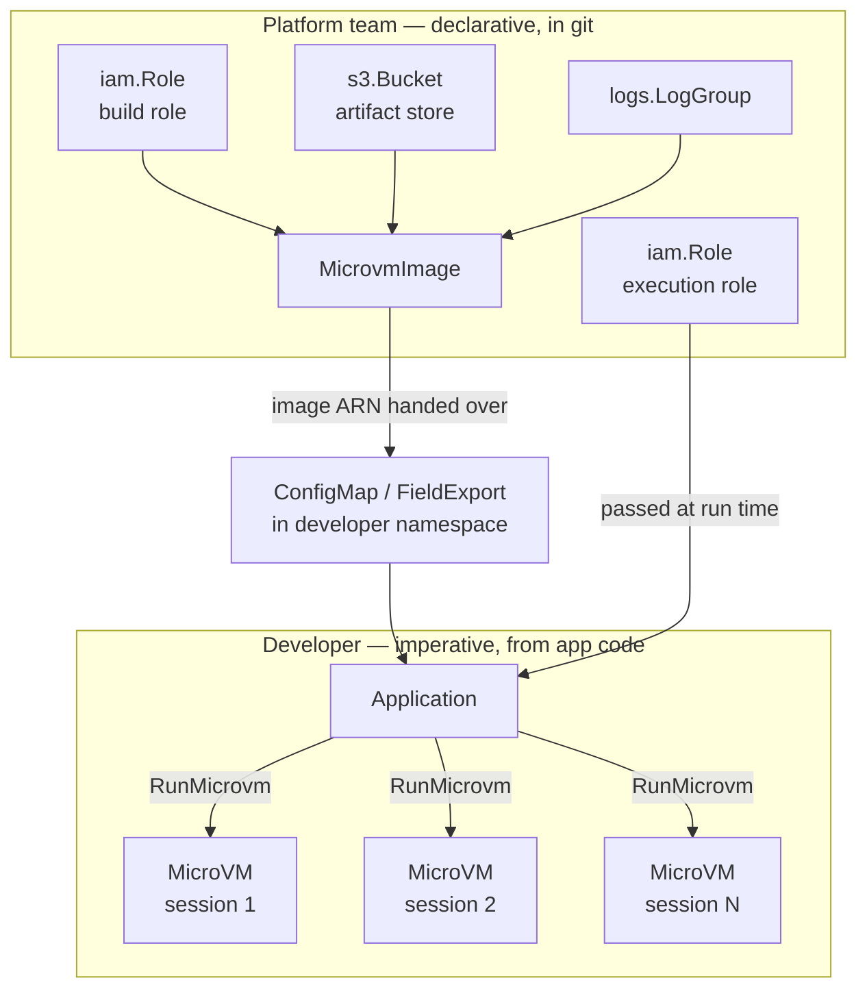

# ACK service controller for Lambda MicroVMs

This repository contains source code for the AWS Controllers for Kubernetes
(ACK) service controller for Lambda MicroVMs.

Please [log issues][ack-issues] and feedback on the main AWS Controllers for
Kubernetes Github project.

[ack-issues]: https://github.com/aws/aws-controllers-k8s/issues

## Contents

- [About Lambda MicroVMs](#about-lambda-microvms)
- [What this controller manages](#what-this-controller-manages)
- [Division of responsibility](#division-of-responsibility)
  - [The three IAM roles](#the-three-iam-roles)
  - [What is deliberately not a custom resource](#what-is-deliberately-not-a-custom-resource)
  - [When not to reach for a custom resource](#when-not-to-reach-for-a-custom-resource)
- [Installation](#installation)
  - [Controller IAM permissions](#controller-iam-permissions)
  - [Install the Helm chart](#install-the-helm-chart)
  - [Verify the installation](#verify-the-installation)
- [Examples](#examples)
- [Contributing](#contributing)
- [License](#license)

## About Lambda MicroVMs

[AWS Lambda MicroVMs][microvms-guide] are serverless compute environments that
provide VM-level isolation with full operating system capabilities, built on the
same Firecracker virtualization that powers Lambda functions. They are designed
for workloads where multiple users or AI agents connect to a compute environment
and run code: interactive development environments, AI code execution sandboxes,
data analytics workloads, security scanning, reinforcement learning
environments, multi-tenant CI/CD, and game servers.

The service model has two distinct halves:

1. **Build a MicroVM image.** You package application code and a `Dockerfile`
   into a zip archive and upload it to Amazon S3. Lambda executes the
   `Dockerfile`, starts your application, and captures a snapshot of the fully
   initialized environment.
2. **Run MicroVMs from that image.** Each image can launch many MicroVMs — one
   per tenant, user session, or job. MicroVMs start from the snapshot, so they
   skip application initialization. Clients reach them over a dedicated HTTPS
   endpoint, with no load balancer or ingress infrastructure. Idle MicroVMs can
   be suspended, preserving memory and disk state, and resumed when traffic
   returns.

[microvms-guide]: https://docs.aws.amazon.com/lambda/latest/dg/lambda-microvms-guide.html

## What this controller manages

The controller reconciles two custom resources in the
`lambdamicrovms.services.k8s.aws/v1alpha1` API group:

| Kind | AWS operations | Purpose |
| --- | --- | --- |
| `MicrovmImage` | `CreateMicrovmImage`, `UpdateMicrovmImage`, `DeleteMicrovmImage`, `GetMicrovmImage` | Build and version a snapshot image from a code artifact in S3 |
| `Microvm` | `RunMicrovm`, `GetMicrovm`, `TerminateMicrovm` | Run a single named MicroVM instance from an image |

Not every Lambda MicroVMs API operation is exposed as a custom resource. That is
deliberate, and understanding the boundary will save you time — see
[Division of responsibility](#division-of-responsibility).

## Division of responsibility

This controller is designed around a split between two audiences. Getting this
split right is the difference between a system that works and one that fights
you.

**Platform and infrastructure teams work declaratively.** The roles, buckets, log
groups, network connectors, and MicroVM images are long-lived infrastructure.
They belong in git, they should be reviewed, and they change on the order of days
or weeks. This is what ACK is for.

**Developers work through the API.** Running a MicroVM for a user session,
suspending it, resuming it, minting an auth token, terminating it — these are part
of the active application lifecycle. They happen at request speed, from
application code, using the AWS SDK. They are not Kubernetes objects.

| | Platform / infrastructure (ACK, declarative) | Developer (Lambda API, imperative) |
| --- | --- | --- |
| Owns | Build and execution roles, artifact bucket, log groups, network connectors, `MicrovmImage` | `RunMicrovm`, suspend, resume, terminate, auth tokens, endpoint traffic |
| Cadence | Hours to days | Milliseconds to minutes |
| Failure mode | Drift, corrected on the next reconcile | Request-scoped, retried by the application |
| Representation | Custom resources in git, reviewed like any other change | SDK calls from application code |



The reconciliation cadence is the concrete evidence for this split.
[`helm/values.yaml`](helm/values.yaml) ships with:

```yaml
reconcile:
  # The default duration, in seconds, to wait before resyncing desired state of custom resources.
  defaultResyncPeriod: 36000 # 10 Hours
```

Ten hours. ACK is a reconciler for infrastructure that changes slowly. A
resource whose correctness depends on being observed within seconds is in the
wrong system.

### The three IAM roles

Three separate roles are involved, and conflating them is the most common source
of confusion. Only the first belongs to the controller.

| Role | Trusted by | Grants | Defined where |
| --- | --- | --- | --- |
| **Controller role** | EKS OIDC (IRSA) or EKS Pod Identity | `lambda:*Microvm*` calls plus `iam:PassRole` to Lambda | [`config/iam/recommended-inline-policy`](config/iam/recommended-inline-policy) |
| **Build role** | `lambda.amazonaws.com` | Read the code artifact from S3, write build logs to CloudWatch | You create it; passed via `MicrovmImage.spec.buildRoleARN` |
| **Execution role** | `lambda.amazonaws.com` | Whatever the application inside the MicroVM needs | You create it; passed via `Microvm.spec.executionRoleARN` |

The build role's trust policy must allow both `sts:AssumeRole` and
`sts:TagSession`:

```json
{
  "Version": "2012-10-17",
  "Statement": [{
    "Effect": "Allow",
    "Principal": { "Service": "lambda.amazonaws.com" },
    "Action": ["sts:AssumeRole", "sts:TagSession"]
  }]
}
```

Omitting `sts:TagSession` is a frequent and confusing failure: the role looks
correct, and the image build fails anyway.

### What is deliberately not a custom resource

The Lambda MicroVMs API has more operations than this controller exposes. The
omissions in [`generator.yaml`](generator.yaml) trace the platform/developer
boundary rather than reflecting unfinished work.

| Omitted resource | Why |
| --- | --- |
| `MicrovmAuthToken`, `MicrovmShellAuthToken` | Tokens are per-request credentials with a lifetime measured in minutes. Storing one in etcd and reconciling it every ten hours makes no sense; they are minted by application code when needed. |
| `MicrovmImageVersion`, `MicrovmImageBuild` | Build artifacts produced by a declarative parent. They are observable through `MicrovmImage` status fields (`imageVersion`, `latestActiveImageVersion`, `latestFailedImageVersion`) rather than separately reconciled. |
| `ManagedMicrovmImage`, `ManagedMicrovmImageVersion` | Read-only catalogue of Lambda-provided base images. Nothing to reconcile — discover them with `aws lambda-microvms list-managed-microvm-images`. |

`Microvm` has no update operation for the same reason. `RunMicrovm` and
`TerminateMicrovm` exist; there is no `UpdateMicrovm`. Lifecycle transitions are
API calls, not spec edits.

This is enforced rather than merely undocumented. Editing any field of a
`Microvm` spec produces a terminal error — `sdkUpdate` returns
`NotImplemented`, and the controller sets an `ACK.Terminal` condition on the
resource. To change a running MicroVM's configuration, delete the resource and
create a new one.

### When not to reach for a custom resource

Use the AWS SDK from your application, not a custom resource, when you are:

- **Creating a MicroVM per user session, request, or job.** This is the primary
  use case for the service and it is the wrong fit for a CRD. Each session would
  become an etcd object reconciled on a ten-hour cycle, with creation latency
  gated by the controller's work queue rather than by `RunMicrovm`.
- **Suspending or resuming based on activity.** Configure `idlePolicy` on the
  resource for automatic behaviour, or call the API directly. There is no spec
  field to toggle.
- **Minting auth tokens.** Always an API call, always short-lived.
- **Managing anything with a lifetime shorter than the resync period.** If the
  resource will be gone before the controller looks at it again, the controller
  is not adding value.

A `Microvm` custom resource is the right choice for a small number of long-lived,
named MicroVMs that the platform team owns: a shared development box, a pinned
demo environment, a staging instance. It is not a mechanism for fan-out.

## Installation

The controller is distributed as a Helm chart and a container image in Amazon
ECR Public. The current release is `0.1.1`.

### Controller IAM permissions

The controller needs its own IAM role — distinct from the roles Lambda assumes to
build an image or to run a MicroVM. The permissions it requires are checked into
this repository at
[`config/iam/recommended-inline-policy`](config/iam/recommended-inline-policy):

```json
{
  "Version": "2012-10-17",
  "Statement": [
    {
      "Effect": "Allow",
      "Action": [
        "lambda:CreateMicrovmImage",
        "lambda:UpdateMicrovmImage",
        "lambda:DeleteMicrovmImage",
        "lambda:GetMicrovmImage",
        "lambda:GetMicrovmImageVersion",
        "lambda:ListMicrovmImages",
        "lambda:RunMicrovm",
        "lambda:GetMicrovm",
        "lambda:TerminateMicrovm",
        "lambda:ListMicrovms",
        "lambda:TagResource",
        "lambda:UntagResource",
        "lambda:ListTags"
      ],
      "Resource": "*"
    },
    {
      "Effect": "Allow",
      "Action": "iam:PassRole",
      "Resource": "*",
      "Condition": {
        "StringEquals": {
          "iam:PassedToService": "lambda.amazonaws.com"
        }
      }
    }
  ]
}
```

The `iam:PassRole` statement is what lets the controller hand a build role or an
execution role to Lambda when it creates a `MicrovmImage` or a `Microvm`. The
`iam:PassedToService` condition constrains that to Lambda, so the controller
cannot pass roles to any other service. Without this statement, resource creation
fails even though every `lambda:` action is permitted.

Scope `Resource` down from `*` to specific image and MicroVM ARNs if your
environment requires it. The permissions above are the minimum set of API calls
the controller makes; narrowing the resources it may act on is independent of
that.

Associate the role with the controller's service account using [IRSA][irsa] or
[EKS Pod Identity][pod-identity]. The chart creates a service account named
`ack-lambdamicrovms-controller`; for IRSA, annotate it with the role ARN as shown
below.

[irsa]: https://docs.aws.amazon.com/eks/latest/userguide/iam-roles-for-service-accounts.html
[pod-identity]: https://docs.aws.amazon.com/eks/latest/userguide/pod-identities.html

### Install the Helm chart

```bash
export SERVICE=lambdamicrovms
export RELEASE_VERSION=0.1.1
export ACK_SYSTEM_NAMESPACE=ack-system
export AWS_REGION=us-east-1
export ACK_CONTROLLER_ROLE_ARN=arn:aws:iam::123456789012:role/ack-lambdamicrovms-controller

helm install \
  --namespace "$ACK_SYSTEM_NAMESPACE" --create-namespace \
  --set "aws.region=$AWS_REGION" \
  --set "serviceAccount.annotations.eks\.amazonaws\.com/role-arn=$ACK_CONTROLLER_ROLE_ARN" \
  ack-"$SERVICE"-controller \
  "oci://public.ecr.aws/aws-controllers-k8s/$SERVICE-chart" --version="$RELEASE_VERSION"
```

If you use EKS Pod Identity instead of IRSA, omit the `serviceAccount.annotations`
flag and create a pod identity association for the
`ack-lambdamicrovms-controller` service account in the release namespace.

Settings worth knowing about, all in
[`helm/values.yaml`](helm/values.yaml):

| Value | Default | Notes |
| --- | --- | --- |
| `aws.region` | `""` | Region for AWS API calls. Set this. |
| `installScope` | `cluster` | Set to `namespace` and pair with `watchNamespace` to restrict the controller to specific namespaces. `watchNamespace` accepts a comma-separated list. |
| `watchSelectors` | `""` | Comma-separated `label=value` selectors to further filter which resources are reconciled. |
| `deletionPolicy` | `delete` | Set to `retain` to leave AWS resources intact when their custom resources are deleted. |
| `reconcile.defaultResyncPeriod` | `36000` | Ten hours. See [Division of responsibility](#division-of-responsibility). |
| `enableCrossNamespace` | `true` | Required for resource references, secret references, and field exports that cross namespace boundaries. |
| `leaderElection.enabled` | `false` | Enable before increasing `deployment.replicas` beyond 1. |

**Region availability.** Lambda MicroVMs is not available in every AWS Region.
This repository does not encode a region list, so check the
[Lambda MicroVMs documentation][microvms-guide] for current availability rather
than assuming a region works.

### Verify the installation

```bash
kubectl get pods -n ack-system
kubectl get crds | grep lambdamicrovms
```

You should see a running controller pod and two established custom resource
definitions:

```
microvmimages.lambdamicrovms.services.k8s.aws
microvms.lambdamicrovms.services.k8s.aws
```

## Examples

Runnable manifests live in [`examples/`](examples/). Start with
[`examples/README.md`](examples/README.md) for an index.

## Contributing

We welcome community contributions and pull requests.

See our [contribution guide](/CONTRIBUTING.md) for more information on how to
report issues, set up a development environment, and submit code.

We adhere to the [Amazon Open Source Code of Conduct][coc].

You can also learn more about our [Governance](/GOVERNANCE.md) structure.

[coc]: https://aws.github.io/code-of-conduct

## License

This project is [licensed](/LICENSE) under the Apache-2.0 License.
