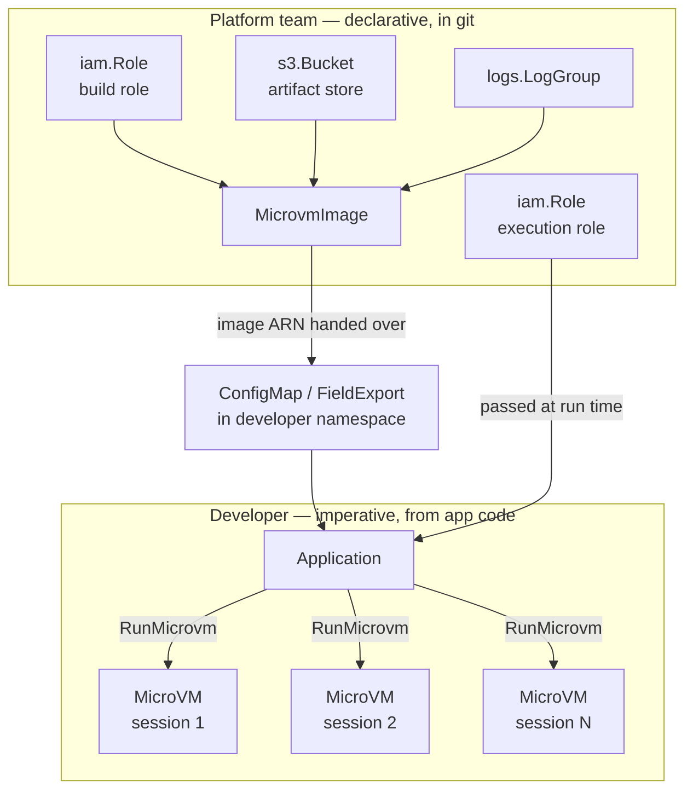

# ACK service controller for Lambda MicroVMs

This repository contains source code for the AWS Controllers for Kubernetes
(ACK) service controller for Lambda MicroVMs.

Please [log issues][ack-issues] and feedback on the main AWS Controllers for
Kubernetes Github project.

[ack-issues]: https://github.com/aws/aws-controllers-k8s/issues

## Contents

- [About Lambda MicroVMs](#about-lambda-microvms)
- [What this controller manages](#what-this-controller-manages)
- [Division of responsibility](#division-of-responsibility)
  - [The three IAM roles](#the-three-iam-roles)
  - [What is deliberately not a custom resource](#what-is-deliberately-not-a-custom-resource)
  - [When not to reach for a custom resource](#when-not-to-reach-for-a-custom-resource)
- [Quick start](#quick-start)
- [Examples](#examples)
- [Documentation](#documentation)
- [Contributing](#contributing)
- [License](#license)

## About Lambda MicroVMs

[AWS Lambda MicroVMs][microvms-guide] are serverless compute environments that
provide VM-level isolation with full operating system capabilities, built on the
same Firecracker virtualization that powers Lambda functions. They are designed
for workloads where multiple users or AI agents connect to a compute environment
and run code: interactive development environments, AI code execution sandboxes,
data analytics workloads, security scanning, reinforcement learning
environments, multi-tenant CI/CD, and game servers.

The service model has two distinct halves:

1. **Build a MicroVM image.** You package application code and a `Dockerfile`
   into a zip archive and upload it to Amazon S3. Lambda executes the
   `Dockerfile`, starts your application, and captures a snapshot of the fully
   initialized environment.
2. **Run MicroVMs from that image.** Each image can launch many MicroVMs — one
   per tenant, user session, or job. MicroVMs start from the snapshot, so they
   skip application initialization. Clients reach them over a dedicated HTTPS
   endpoint, with no load balancer or ingress infrastructure. Idle MicroVMs can
   be suspended, preserving memory and disk state, and resumed when traffic
   returns.

[microvms-guide]: https://docs.aws.amazon.com/lambda/latest/dg/lambda-microvms-guide.html

## What this controller manages

The controller reconciles two custom resources in the
`lambdamicrovms.services.k8s.aws/v1alpha1` API group:

| Kind | AWS operations | Purpose |
| --- | --- | --- |
| `MicrovmImage` | `CreateMicrovmImage`, `UpdateMicrovmImage`, `DeleteMicrovmImage`, `GetMicrovmImage` | Build and version a snapshot image from a code artifact in S3 |
| `Microvm` | `RunMicrovm`, `GetMicrovm`, `TerminateMicrovm` | Run a single named MicroVM instance from an image |

Not every Lambda MicroVMs API operation is exposed as a custom resource. That is
deliberate, and understanding the boundary will save you time — see
[Division of responsibility](#division-of-responsibility).

## Division of responsibility

This controller is designed around a split between two types of operation and audience. Getting this
split right is important to get the most out of the controller.

**Platform and infrastructure teams work declaratively.** The roles, buckets, log
groups, network connectors, and MicroVM images are long-lived infrastructure.
They are handled in git, they should be reviewed, and they change on the order of days
or weeks. This is what the ACK controller manages.

**Developers work through the API.** Running a MicroVM for a user session,
suspending it, resuming it, minting an auth token, terminating it — these are part
of the active application lifecycle. They happen at request speed, from
application code, using the AWS SDK. They are not expected to be managed as Kubernetes objects.

| | Platform / infrastructure (ACK, declarative) | Developer (Lambda API, imperative) |
| --- | --- | --- |
| Owns | Build and execution roles, artifact bucket, log groups, network connectors, `MicrovmImage` | `RunMicrovm`, suspend, resume, terminate, auth tokens, endpoint traffic |
| Cadence | Hours to days | Milliseconds to minutes |
| Failure mode | Drift, corrected on the next reconcile | Request-scoped, retried by the application |
| Representation | Custom resources in git, reviewed like any other change | SDK calls from application code |



One boundary inside the diagram is worth making explicit: the platform team owns
the artifact **bucket**, but CI owns its **contents**. Publishing `app.zip` happens
on every commit, so it is a pipeline step rather than a custom resource — see
[`examples/ci/`](examples/ci/). The bucket is long-lived infrastructure; the object
inside it is not.

The reconciliation cadence demonstrates the importance of this split.
[`helm/values.yaml`](helm/values.yaml) ships with:

```yaml
reconcile:
  # The default duration, in seconds, to wait before resyncing desired state of custom resources.
  defaultResyncPeriod: 36000 # 10 Hours
```

ACK defaults to ten hours for the reconciler, expecting infrastructure that changes slowly. A
resource whose correctness depends on being observed within seconds is not an ideal fit.

### The three IAM roles

Three separate roles are involved, and conflating them is the most common source
of confusion. Only the first belongs to the controller.

| Role | Trusted by | Grants | Defined where |
| --- | --- | --- | --- |
| **Controller role** | EKS OIDC (IRSA) or EKS Pod Identity | `lambda:*Microvm*` calls plus `iam:PassRole` to Lambda | [`config/iam/recommended-inline-policy`](config/iam/recommended-inline-policy) |
| **Build role** | `lambda.amazonaws.com` | Read the code artifact from S3, write build logs to CloudWatch | You create it; passed via `MicrovmImage.spec.buildRoleARN` |
| **Execution role** | `lambda.amazonaws.com` | Whatever the application inside the MicroVM needs | You create it; passed via `Microvm.spec.executionRoleARN` |

The build role's trust policy must allow both `sts:AssumeRole` and
`sts:TagSession`:

```json
{
  "Version": "2012-10-17",
  "Statement": [{
    "Effect": "Allow",
    "Principal": { "Service": "lambda.amazonaws.com" },
    "Action": ["sts:AssumeRole", "sts:TagSession"]
  }]
}
```

Omitting `sts:TagSession` is a frequent cause of failure: the role looks
correct, and the image build fails anyway.

### What is deliberately not a custom resource

The Lambda MicroVMs API has more operations than this controller exposes. The omissions follow the platform/developer
boundary explained above.

| Omitted resource | Why |
| --- | --- |
| `MicrovmAuthToken`, `MicrovmShellAuthToken` | Tokens are per-request credentials with a lifetime measured in minutes. Storing one in etcd and reconciling it every ten hours makes no sense; they are minted by application code when needed. |
| `MicrovmImageVersion`, `MicrovmImageBuild` | Build artifacts produced by a declarative parent. They are observable through `MicrovmImage` status fields (`imageVersion`, `latestActiveImageVersion`, `latestFailedImageVersion`) rather than separately reconciled. |
| `ManagedMicrovmImage`, `ManagedMicrovmImageVersion` | Read-only catalogue of Lambda-provided base images. Nothing to reconcile — discover them with the `ListManagedMicrovmImages` operation. |

`Microvm` has no update operation for the same reason. `RunMicrovm` and
`TerminateMicrovm` exist; there is no `UpdateMicrovm`. Lifecycle transitions are
API calls, not spec edits.

This is enforced rather than merely undocumented. Editing any field of a
`Microvm` spec produces a terminal error — `sdkUpdate` returns
`NotImplemented`, and the controller sets an `ACK.Terminal` condition on the
resource. To change a running MicroVM's configuration, delete the resource and
create a new one.

### When not to reach for a custom resource

Use the AWS SDK from your application, not a custom resource, when you are:

- **Creating a MicroVM per user session, request, or job.** This is the primary
  use case for the service and it is the wrong fit for a CRD. Each session would
  become an etcd object reconciled on a ten-hour cycle, with creation latency
  gated by the controller's work queue rather than by `RunMicrovm`.
- **Suspending or resuming based on activity.** Configure `idlePolicy` on the
  resource for automatic behaviour, or call the API directly. There is no spec
  field to toggle.
- **Minting auth tokens.** Always an API call, always short-lived.
- **Managing anything with a lifetime shorter than the resync period.** If the
  resource will be gone before the controller looks at it again, the controller
  is not adding value.

A `Microvm` custom resource is the right choice for a small number of long-lived,
named MicroVMs that the platform team owns: a shared development box, a pinned
demo environment, a staging instance. It is not a mechanism for fan-out.

## Quick start

The controller is distributed as a Helm chart and a container image in Amazon
ECR Public. Released versions are listed on the
[`lambdamicrovms-chart` gallery page](https://gallery.ecr.aws/aws-controllers-k8s/lambdamicrovms-chart).

It needs an IAM role of its own, distinct from the build and execution roles
Lambda assumes. The permissions are checked into
[`config/iam/recommended-inline-policy`](config/iam/recommended-inline-policy);
[Installation](docs/installation.md) explains them, including the two that are
easy to miss — `iam:PassRole` scoped by role ARN with no
`iam:PassedToService` condition, and `lambda:PassNetworkConnector`.

```bash
export SERVICE=lambdamicrovms
export RELEASE_VERSION=0.2.1   # check the gallery for the current release
export ACK_SYSTEM_NAMESPACE=ack-system
export AWS_REGION=us-east-1
export ACK_CONTROLLER_ROLE_ARN=arn:aws:iam::123456789012:role/ack-lambdamicrovms-controller

helm install \
  --namespace "$ACK_SYSTEM_NAMESPACE" --create-namespace \
  --set "aws.region=$AWS_REGION" \
  --set "serviceAccount.annotations.eks\.amazonaws\.com/role-arn=$ACK_CONTROLLER_ROLE_ARN" \
  ack-"$SERVICE"-controller \
  "oci://public.ecr.aws/aws-controllers-k8s/$SERVICE-chart" --version="$RELEASE_VERSION"
```

```bash
kubectl get pods -n ack-system
kubectl get crds | grep lambdamicrovms
```

You should see a running controller pod and two established custom resource
definitions:

```
microvmimages.lambdamicrovms.services.k8s.aws
microvms.lambdamicrovms.services.k8s.aws
```

**Region availability.** Lambda MicroVMs is not available in every AWS Region.
This repository does not encode a region list, so check the
[Lambda MicroVMs documentation][microvms-guide] for current availability rather
than assuming a region works.

From here, [`examples/01-platform-quickstart/`](examples/01-platform-quickstart/)
builds a first image and ends with an ARN to hand to a developer. For EKS Pod
Identity, chart values, and the full IAM policy, see
[Installation](docs/installation.md).

## Examples

Runnable manifests live in [`examples/`](examples/), organised by which side of
the [responsibility split](#division-of-responsibility) they sit on. Each
directory has its own README with prerequisites and expected output.

**Start here** depending on your role:

| If you are… | Start with | Then |
| --- | --- | --- |
| A platform engineer building an image | [`01-platform-quickstart/`](examples/01-platform-quickstart/) | [`04-features/`](examples/04-features/), [`05-lifecycle/`](examples/05-lifecycle/) |
| A platform engineer with several environments to manage | [`06-kro/`](examples/06-kro/) | [`05-lifecycle/`](examples/05-lifecycle/) |
| A developer who needs to run MicroVMs | [`02-developer-handoff/`](examples/02-developer-handoff/) | [`ci/`](examples/ci/) |
| Setting up CI | [`ci/`](examples/ci/) | [`05-lifecycle/`](examples/05-lifecycle/) |

[`examples/README.md`](examples/README.md) indexes all of them with shared
conventions.

## Documentation

| Document | Covers |
| --- | --- |
| [Installation](docs/installation.md) | Controller IAM permissions, Helm chart values, verifying the install |
| [Resource reference](docs/resource-reference.md) | Every `MicrovmImage` and `Microvm` field, base image versions, logging, reaching a running MicroVM |
| [Troubleshooting](docs/troubleshooting.md) | Reading conditions, finding build logs, common failures, forcing a reconcile |

## Contributing

We welcome community contributions and pull requests.

See our [contribution guide](/CONTRIBUTING.md) for more information on how to
report issues, set up a development environment, and submit code.

We adhere to the [Amazon Open Source Code of Conduct][coc].

You can also learn more about our [Governance](/GOVERNANCE.md) structure.

[coc]: https://aws.github.io/code-of-conduct

## License

This project is [licensed](/LICENSE) under the Apache-2.0 License.
