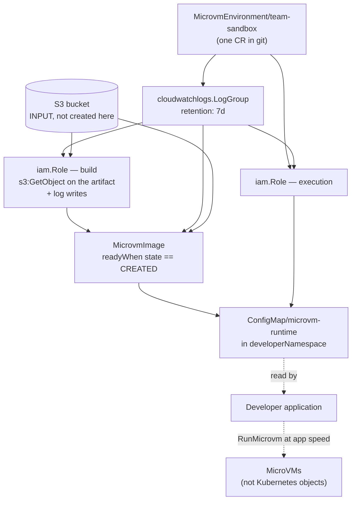

# 06 — kro: a `MicrovmEnvironment` API

Compose the platform layer into a single custom API using
[kro](https://kro.run), so a platform team commits seven values per environment
instead of five manifests.

| File | Purpose |
| --- | --- |
| [`rgd.yaml`](rgd.yaml) | The `ResourceGraphDefinition` defining the `MicrovmEnvironment` API |
| [`instance.yaml`](instance.yaml) | An instance — what a platform team commits per environment |
| [`kro-rbac.yaml`](kro-rbac.yaml) | Permissions kro needs over the ACK resources in the graph |

## What the abstraction covers



kro infers this ordering from the CEL references between resources. There is no
explicit `dependsOn`: `buildRole` references `${logGroup.spec.name}`, so the log
group is created first, and so on. `status.topologicalOrder` on the RGD shows the
computed order.

## The API

```yaml
spec:
  name: string | required=true
  region: string | required=true
  baseImageARN: string | required=true
  artifact:
    bucket: string | required=true
    key: string | default="app.zip"
  memoryMiB: integer | default=2048 minimum=2048
  logRetentionDays: integer | default=7
  developerNamespace: string | required=true
```

Everything else is derived: a log group with a retention policy, a build role
with a correct trust policy and least-privilege access to exactly one S3 object,
an execution role, the image build, and the handoff ConfigMap.

## Three deliberate design decisions

### The bucket is an input, not a resource in the graph

The obvious version of this RGD creates the artifact bucket too. It cannot
usefully do so.

The image build reads an object *from* the bucket, so the artifact must already
exist when the image is created. An RGD that created the bucket and built the
image in one pass would always fail its first build, because CI has not published
anything yet. You would get a `CREATE_FAILED` image on every fresh environment
and have to wait for a retry after publishing.

The bucket also has a different lifecycle. Retention, encryption, and access
policies are typically managed once and centrally, and outlive any individual
environment.

So the flow is: bucket exists → CI publishes an artifact
([`../ci/`](../ci/)) → `MicrovmEnvironment` builds an image from it.

### No `Microvm` in the graph

The RGD stops at the image. Its output is an image ARN and an execution role ARN,
not a running MicroVM.

Adding a `Microvm` resource would be easy and would undo the point of the whole
example. Running MicroVMs is a request-path operation belonging in application
code, for the reasons in
[`../03-long-lived-microvm/`](../03-long-lived-microvm/). It would also make the
abstraction worse in a specific way: because `Microvm` has no update operation,
any change to an instance's runtime configuration would put the templated
`Microvm` into a terminal error state, while kro reported the resource as
managed. An abstraction that hides an immutable resource behind a mutable-looking
API is a trap.

Consequently there is no `endpoint` in `status`. There is no single MicroVM to
have one.

### ARN references instead of ACK's `*Ref` fields

The image could use `buildRoleRef` to resolve the role by Kubernetes name. It
uses `${buildRole.status.ackResourceMetadata.arn}` instead.

Both work, but only the CEL reference tells kro that the role must exist before
the image. With `buildRoleRef`, kro would create both at once and rely on the ACK
controller retrying until the reference resolves — which works, but produces
confusing intermediate errors and no ordering guarantee. Prefer CEL references
inside a graph, and `*Ref` fields when writing standalone manifests.

## Prerequisites

- **kro 0.9 or later.** Earlier versions used `ResourceGroup` rather than
  `ResourceGraphDefinition`.
- **ACK controllers** for `lambdamicrovms`, `iam`, and `cloudwatchlogs`. kro
  templates the custom resources; the ACK controllers reconcile them. kro
  validates that every referenced CRD exists when the RGD is created, so a
  missing controller surfaces immediately as
  `ResourceGraphAccepted: False`.
- **RBAC** from [`kro-rbac.yaml`](kro-rbac.yaml).
- **An S3 bucket with a published artifact** — see
  [`../ci/`](../ci/).
- **The developer namespace**, created beforehand. The RGD writes a ConfigMap
  into it but does not create it, so that kro is not in the business of managing
  namespace lifecycles.

## Steps

**1. Grant kro access to the ACK resources.**

Check the service account name in `kro-rbac.yaml` matches your installation:

```bash
kubectl get deploy -A -l app.kubernetes.io/name=kro \
  -o jsonpath='{.items[0].spec.template.spec.serviceAccountName}'

kubectl apply -f kro-rbac.yaml
```

**2. Create the RGD.**

```bash
kubectl apply -f rgd.yaml
```

kro validates the whole graph up front — schema syntax, that every referenced CRD
exists, that every CEL expression type-checks against the real resource schemas,
and that there are no dependency cycles. All three conditions must be `True`:

```bash
kubectl get rgd microvm-environment
```

```
NAME                  APIVERSION   KIND                 STATE    AGE
microvm-environment   v1alpha1     MicrovmEnvironment   ACTIVE   10s
```

```bash
kubectl get rgd microvm-environment \
  -o jsonpath='{range .status.conditions[*]}{.type}={.status}{"\n"}{end}'
```

```
ResourceGraphAccepted=True
KindReady=True
ControllerReady=True
```

If `ResourceGraphAccepted` is `False`, the `message` field contains the specific
validation error. Also useful:

```bash
kubectl get rgd microvm-environment -o jsonpath='{.status.topologicalOrder}'
```

```json
["logGroup","buildRole","executionRole","image","handoff"]
```

**3. Create an instance.**

```bash
kubectl create namespace sandbox-app
sed -i "s|<your-bucket-name>|$BUCKET|g" instance.yaml
kubectl apply -f instance.yaml
```

**4. Watch it converge.**

```bash
kubectl get microvmenvironments --watch
```

```
NAME           IMAGE-STATE   VERSION   AGE
team-sandbox   <none>        <none>    5s
team-sandbox   CREATING      <none>    30s
team-sandbox   CREATED       1.0       4m
```

The instance reaches `state: ACTIVE` once every resource is ready, which for the
image means `readyWhen` is satisfied — a genuinely successful build, not merely
an existing resource.

**5. Confirm the handoff.**

```bash
kubectl get configmap microvm-runtime -n sandbox-app -o yaml
```

A developer application in `sandbox-app` can now run MicroVMs, exactly as in
[`../02-developer-handoff/`](../02-developer-handoff/) — the ConfigMap has the
same keys, so `run_session.py` works unchanged against either.

## Deletion order

kro deletes in reverse topological order, which is what the service requires:
the image is removed before the build role and log group it depends on.

```bash
kubectl delete -f instance.yaml
```

Terminate any MicroVMs launched from the image first. They are not Kubernetes
objects and nothing in this graph knows about them — which is the trade-off of
keeping them out of the graph, and why applications should terminate the MicroVMs
they create.

## Identifying kro-managed images

The controller's Helm chart includes `kro.run/kro-version=%KRO_VERSION%` in its
`resourceTags`, so images created through kro carry a tag recording the kro
version alongside the usual ACK tags. Useful for telling apart resources created
through an abstraction from ones created by a direct manifest, in the console or
in Cost Explorer.

## Extending this

**Private ECR base layers.** If your `Dockerfile` pulls from a private ECR
repository, add `ecr:GetAuthorizationToken` and `ecr:BatchGetImage` to the build
role's inline policy, and add an `ecr.services.k8s.aws/Repository` resource if
you want the RGD to own the repository as well.

**Per-environment egress restrictions.** Add an `egress` field to the schema and
template `egressNetworkConnectors` on the image from it — an empty list gives a
MicroVM no outbound access at all, which is a reasonable default for sandboxes
running untrusted code.

**Multiple images per environment.** Use `forEach` over a list of image
specifications rather than duplicating the resource.

## A note on verification

The manifests here were validated structurally: every templated resource's fields
were checked against the real CRD schemas from the `lambdamicrovms`, `iam`, and
`cloudwatchlogs` controllers and the ACK runtime, all embedded IAM policy
documents parse as JSON, and the kro syntax follows the 0.9.x specification for
`schema`, `readyWhen`, CEL string templates, and printer columns.

The graph has not been applied to a live cluster with kro and all three ACK
controllers installed. If you hit a discrepancy, `kubectl get rgd
microvm-environment -o yaml` and its `ResourceGraphAccepted` message are the
fastest way to find it, since kro validates everything up front rather than at
instance-creation time.
